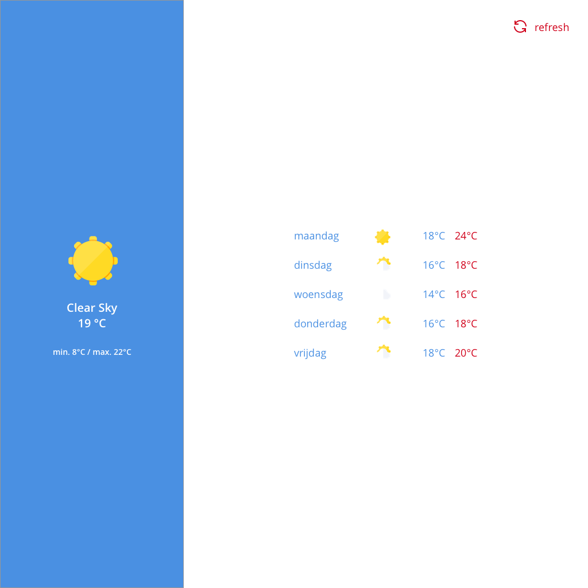

# Weather Station

Weather App built with React.

[Browser coverage](https://browserslist.dev/?q=PjAuMiUgYW5kIG5vdCBkZWFkIG9yIG5vdCBvcF9taW5pIGFsbA%3D%3D)

## Tech Stack

**React, Typescript, Redux**

## Features

- **Weather forecast for current location**
- **Extended 5 days forecast**

## Getting Started

First you need an API key from OpenWeatherMap, you can get one by creating an account on their website.
After you got your API key, create a **.env** file at root directory of project, copy the line below to the file and replace YOUR_KEY with your OpenWeatherMap API Key.

```
REACT_APP_OPENWEATHER_API_KEY=YOUR_KEY
```

Finally clone this repository, install dependencies and run the local server

```bash
git clone https://github.com/arangates/weather-station
```

```bash
cd weather-station
npm install
npm start
```

## Desktop



## Tablet


## Mobile


## Credits

[OpenWeatherMap](https://openweathermap.org/ "OpenWeatherMap") (Weather data API)
